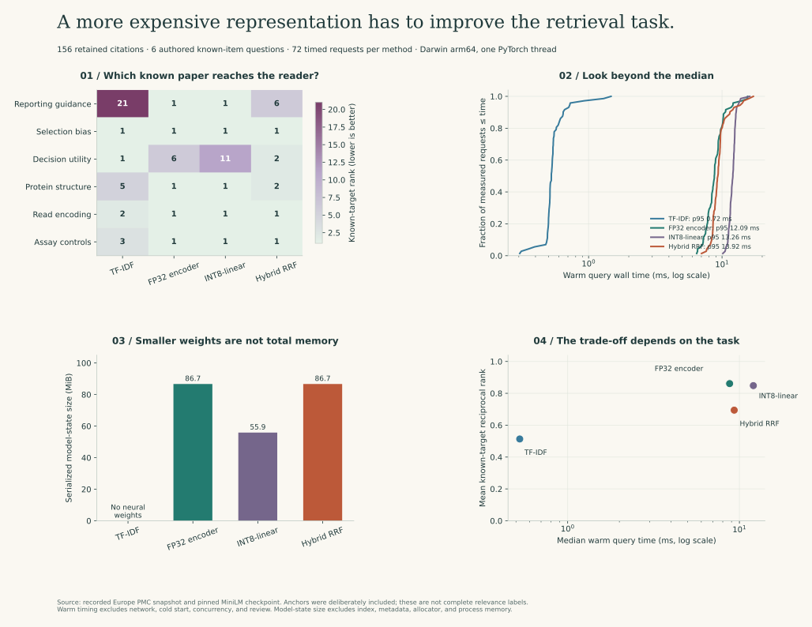

# 

A useful result should leave the next person with more clarity, not another layer of guesswork. I use Python to explore a question that keeps returning in biological data: **what would make this result trustworthy enough to change the next experiment?** I begin with the measurement and its history, then follow the assumptions into the mathematics, the implementation, and the decision it might support.

I’m **Cazandra Aporbo**. Here I keep that reasoning close to the code: public-data studies, deliberately difficult test cases, and walkthroughs of the steps that are easy to skip. You can read an analysis, reproduce its output, inspect a failure, and then change one assumption without having to reconstruct the whole project first.

<div class="route-buttons">
<a class="button" href="https://cazzy-aporbo.github.io/Curious-Coder/START_HERE.html">Start reading or running</a>
<a class="button berry" href="https://cazzy-aporbo.github.io/Curious-Coder/biotech/README.html">Work through biotech QC</a>
<a class="button" href="https://cazzy-aporbo.github.io/Curious-Coder/studies/learning_signals.html">See when a signal misleads</a>
<a class="button berry" href="https://cazzy-aporbo.github.io/Curious-Coder/studies/evidence_contracts.html">Explain without changing the claim</a>
<a class="button secondary" href="https://cazzy-aporbo.github.io/Curious-Coder/studies/protein_adaptation.html">Inspect pretrained weights</a>
</div>

[](https://github.com/Cazzy-Aporbo/Curious-Coder/actions/workflows/ci.yml) [](https://cazzy-aporbo.github.io/Curious-Coder/)

| Start here | Then | Then |
| --- | --- | --- |
| [**Find the evidence** →](https://cazzy-aporbo.github.io/Curious-Coder/studies/evidence_retrieval.html) | [**Bound the explanation** →](https://cazzy-aporbo.github.io/Curious-Coder/studies/evidence_contracts.html) | [**Check the signal you optimize** →](https://cazzy-aporbo.github.io/Curious-Coder/studies/learning_signals.html) |
| [**Inspect the measurement** →](https://cazzy-aporbo.github.io/Curious-Coder/biotech/README.html) | [**Follow the process record** →](https://cazzy-aporbo.github.io/Curious-Coder/biotech/facility_workflow.html) | [**Compare models honestly** →](https://cazzy-aporbo.github.io/Curious-Coder/studies/statistical_validation.html) |

## What you can see me use here

Every badge below points to something that runs in this repository—not a wish list.

| Area | Tools and skills |
| --- | --- |
| **Science & statistics** |       |
| **Machine learning** |        |
| **Biology & data** |        |
| **Engineering & integrity** |       |
| **Testing & delivery** |       |

## 

I keep these as independent evidence workflows, not as one model pretending to connect every biological scale. Each route has a concrete input, an inspectable output, and a decision that still belongs to a reviewer.

| Route | Start with | Follow the output |
| --- | --- | --- |
| Find and appraise a method | [Literature retrieval](https://cazzy-aporbo.github.io/Curious-Coder/studies/evidence_retrieval.html) | API provenance → reusable text → lexical/encoder comparison → cited records and notice links |
| Admit and inspect a measurement | [Facility evidence workflow](https://cazzy-aporbo.github.io/Curious-Coder/biotech/facility_workflow.html) | Sensor message → calibration gate → signed transaction → drift/particle checks → [inspection console](https://cazzy-aporbo.github.io/Curious-Coder/biotech/facility_console.html) |
| Check what an optimizer is really chasing | [Learning signals](https://cazzy-aporbo.github.io/Curious-Coder/studies/learning_signals.html) | TD error timing → surprise vs learnable novelty → proxy rising while the real goal falls |
| Explain without changing the claim | [Evidence contracts](https://cazzy-aporbo.github.io/Curious-Coder/studies/evidence_contracts.html) | Approved source → context/use/validity checks → conflict or refusal → reader-specific view with the same facts |
| Test a modeling decision | [Measured classification](https://cazzy-aporbo.github.io/Curious-Coder/studies/clinical_benchmark.html) | Public snapshot → isolated fitting → paired/nested evaluation → explicit decision assumptions |

<details markdown="1">
<summary>Choose a route by the work you do</summary>

- **Scientist or assay developer:** start with [biotech QC](https://cazzy-aporbo.github.io/Curious-Coder/biotech/README.html), then inspect why a valid input can still require process review in the facility study.
- **ML or computational-biology engineer:** compare [protein adaptation](https://cazzy-aporbo.github.io/Curious-Coder/studies/protein_adaptation.html), [text-encoder precision](https://cazzy-aporbo.github.io/Curious-Coder/studies/evidence_retrieval.html), and [distributed objective checks](https://cazzy-aporbo.github.io/Curious-Coder/studies/training_math.html). They change different things and require different evidence.
- **QA or systems reviewer:** inspect the [schema](biotech/facility_schema.sql), signed projection checks, calibration history, and requirement-to-test map in the [facility walkthrough](https://cazzy-aporbo.github.io/Curious-Coder/biotech/facility_workflow.html).
- **New to the repository:** follow [Start here](https://cazzy-aporbo.github.io/Curious-Coder/START_HERE.html) before installing optional model dependencies.

</details>

## Choose the point where your question begins

| If you are asking… | I would start here | What you can run |
| --- | --- | --- |
| Can I trust these reads, sample labels, variants, or assay controls? | [Biotech Python and R&D QC](https://cazzy-aporbo.github.io/Curious-Coder/biotech/README.html) | Paired FASTQ checks, Phred arithmetic, replicate/design audits, reference-aware SNV checks, plate-level Z′, multiple-testing correction |
| Does a more complex model improve this measured problem? | [Diagnostic-feature comparison](https://cazzy-aporbo.github.io/Curious-Coder/studies/clinical_benchmark.html) | Prior, logistic, boosting, and residual-network baselines with fixed splits, uncertainty, and recorded predictions |
| Which weights actually change during biological-model adaptation? | [Pinned ESM-2 adaptation](https://cazzy-aporbo.github.io/Curious-Coder/studies/protein_adaptation.html) | Low-rank query/value updates, frozen-weight digests, masking contracts, adapter artifacts |
| Does my distributed loop optimize the objective I intended? | [Training mathematics](https://cazzy-aporbo.github.io/Curious-Coder/studies/training_math.html) | Actual two-process CPU DDP, unequal token counts, accumulation, and a single-process gradient reference |
| Will the result survive export, retries, or cancellation? | [End-to-end Python engineering](https://cazzy-aporbo.github.io/Curious-Coder/studies/engineering.html) | Preprocessing-inclusive model export, schema checks, numerical parity, bounded async workers, retry budgets, cancellation |
| How do observations, geometry, and durable state fit together? | [Spatial and system design](https://cazzy-aporbo.github.io/Curious-Coder/studies/spatial_systems.html) | NOAA observations, H3 indexing, uncertainty-aware geometry, transactional mutation and replay |

If GitHub or virtual environments are unfamiliar, [start here](https://cazzy-aporbo.github.io/Curious-Coder/START_HERE.html). I explain how to read files, run a study, interpret a failed check, and make a small reviewable change before introducing the heavier examples.

## First, keep the measurement attached to the result

I use 569 published Wisconsin diagnostic records to compare models on 30 image-derived features. Before fitting, I reserve 341 training, 114 validation, and 114 test records. That separation is straightforward; maintaining it through preprocessing, model selection, interpretation, and later experimentation takes more care.


In the recorded run, I select logistic regression by validation log loss. The residual network has a lower test Brier score but a higher test log loss. I keep the original selection rule rather than switching to the metric that makes the more elaborate model look best. The [analysis](https://cazzy-aporbo.github.io/Curious-Coder/studies/clinical_benchmark.html) explains that trade-off, the small calibration bins, the correlated predictors, and the limits of the bootstrap intervals.


<div class="interactive-results"></div>

The figures come from the [recorded run](studies/results/benchmark.json) and [exported predictions](studies/results/test_predictions.csv). They are not illustrative scores. The study is also not clinical validation: it does not establish generalization across hospitals, time, demographic groups, or acquisition procedures.

## Choose the stack with the same care as the method

The [technology and clinical-interface map](https://cazzy-aporbo.github.io/Curious-Coder/studies/technology_map.html) separates what runs here from what is only an appropriate next integration. It covers molecular tooling, model acceleration, single-cell analysis, robotics, hospital resources, radiology, and CDS interfaces without presenting a list of dependencies as evidence of a deployed system.

Two small proofs make the distinction tangible: [CPU memory-sharing boundaries](https://cazzy-aporbo.github.io/Curious-Coder/studies/execution_contracts.html) and a synthetic operating-room/PACU scheduling model. One asks where a copy really occurs; the other checks whether an apparently attractive schedule actually respects the shared resources around it.

## Look at the operational trade-off as well

The [retrieval study](https://cazzy-aporbo.github.io/Curious-Coder/studies/evidence_retrieval.html) compares TF-IDF, a frozen MiniLM encoder, an INT8-linear conversion, and rank fusion on the same retained corpus. All four find five of six authored targets in their top five, but their ordering differs. The compressed model uses less serialized storage without delivering a median-latency improvement on this machine. That is a result to understand, not a reason to relabel the benchmark.



I also keep the selection process visible: the corpus has 156 provider-labeled English records, with 60 included abstracts, 87 withheld under the reuse policy, and nine absent upstream. It is a bounded diagnostic collection, not a claim that publication or language bias has been removed.

<details markdown="1">
<summary>What each model operation changes</summary>

| Operation | Changes | Does not establish |
| --- | --- | --- |
| Fit a clinical-feature model | Parameters learned from a declared training partition | Clinical transportability or a validated action policy |
| Add protein adapters | A small declared set of trainable projection updates | Causal mutation effects, new biological function, or independent validation |
| Quantize a text encoder | Numerical representation and runtime behavior | New knowledge, improved retrieval, or faster inference on every device |
| Fuse retrieval ranks | Ordering of source records | Scientific validity of the retrieved claims |

</details>

## Follow the comparison into its uncertainty

The next question is not simply which number is smaller. I compare losses on the **same records**, then evaluate model selection in a separate, development-only nested procedure. That keeps uncertainty about fixed predictions distinct from variability introduced by fitting and selection.

<picture class="protocol-motion">
<source media="(prefers-reduced-motion: reduce)" srcset="assets/figures/statistical_flow.png">

</picture>

The [statistical walkthrough](https://cazzy-aporbo.github.io/Curious-Coder/studies/statistical_validation.html) connects the equations to paired bootstrap intervals, repeated nested folds, decision-curve assumptions, and prevalence sensitivity. In the recorded run, all four paired intervals include zero; that is not evidence of equivalence. The nested procedure selects C=1 logistic regression in all ten outer fits, yet its OOF log loss still changes across the two split seeds.


I also make a crucial timing constraint explicit: these measurements come from a fine-needle aspirate that has already been obtained. They cannot justify a claim about deciding whether to perform that aspiration beforehand. The story has to remain consistent from the measurement to the eventual decision.

## Then test the parts that can fail quietly

A high score is not the only place to look for evidence. In the [biotech workflow](https://cazzy-aporbo.github.io/Curious-Coder/biotech/README.html), I keep a low-depth unfiltered variant in the report with its review reasons instead of dropping it. I count biological units separately from technical replicates. I calculate plate controls separately so that a poor plate is not hidden by a pooled summary.

In the [protein study](https://cazzy-aporbo.github.io/Curious-Coder/studies/protein_adaptation.html), I adapt 30,720 parameters in a pinned ESM-2 checkpoint and verify that the frozen parameters do not change. The same-fixture reconstruction loss decreases, but I do not treat two homologous hemoglobin sequences as an independent biological evaluation. The useful proof is that the update path, masking, and parameter boundaries behave as intended.

In the [distributed experiment](https://cazzy-aporbo.github.io/Curious-Coder/studies/training_math.html), I split four supervised tokens unevenly across two processes. The naïve mean of local means changes the gradient by about 0.258; the correctly weighted reduction agrees with the reference to numerical precision. That small example exposes an error that can otherwise hide inside a much larger training run.

These are established methods, not claims of new algorithms. My aim is to make the reasoning operational: a declared input, an intended quantity, a counterexample, a test, and a clear next step when the check fails.

## 

The [facility workflow](https://cazzy-aporbo.github.io/Curious-Coder/biotech/facility_workflow.html) makes the operational boundary concrete. It retains 480 accepted synthetic observations and four quarantined cases, binds decisions to signed events, and checks that the displayed relational projection agrees with a signed digest. The console exposes calibration and maintenance history, paginated observations, and inspectable event envelopes.


The [console](https://cazzy-aporbo.github.io/Curious-Coder/biotech/facility_console.html) provides a controllable Sankey-style airflow view and recorded-state playback. It uses a well-mixed model with conservation and positivity tests, not a claim of laminar-flow CFD, sterility, or regulatory certification. A reference accession is not silently converted into a spatial multi-omics measurement.

## Connect the science to the decision

For an R&D team, a useful model might help choose which candidates deserve a confirmatory assay. For a sequencing workflow, useful software might stop an assembly mismatch before it becomes an interpretation. For an engineering team, it might prevent a retry from duplicating a committed state change.

Those are different value propositions. I would evaluate them using the relevant assay budget, error costs, turnaround time, repeat-work rate, and decision quality—not assume that a better benchmark metric automatically creates business value. Each walkthrough separates what I have measured from the study that would be needed to justify an operational claim.

The [spatial example](https://cazzy-aporbo.github.io/Curious-Coder/studies/spatial_systems.html) applies the same discipline to public NOAA temperature observations and explicitly synthetic canopy/material/utility scenarios. It also maps 25 system-design concepts to concrete decisions and failure tests. The local code implements transaction, indexing, and geometry contracts; the deployment topology remains a reference design, not claimed infrastructure.

## Run a complete path

Use Python 3.11 or 3.12. The core studies run on CPU and use retained public snapshots or labeled synthetic fixtures.

```bash
python3 -m venv .venv
source .venv/bin/activate
python -m pip install -r requirements-torch.txt
python -m pip check
python -m biotech.qc
python -m studies.data
MPLBACKEND=Agg OMP_NUM_THREADS=1 python -m studies.run
MPLBACKEND=Agg python -m pytest
python scripts/build_site.py
python -m http.server 8000 --directory _site
```

In PowerShell, activate with `.venv\Scripts\Activate.ps1` and set `$env:MPLBACKEND = 'Agg'` and `$env:OMP_NUM_THREADS = '1'` before the Python commands. The [beginner route](https://cazzy-aporbo.github.io/Curious-Coder/START_HERE.html) explains what each step does and what to inspect when it fails.

Protein adaptation has a separate dependency profile and an explicit first download:

```bash
python -m pip install -r requirements-protein.txt
python -m studies.protein_transfer --download
```

Later protein runs load the pinned local resources offline. I keep large checkpoints and exported bundles under ignored `artifacts/`; small public sequence fixtures, provenance, and run reports stay with the studies. [Data provenance](https://cazzy-aporbo.github.io/Curious-Coder/data/README.html) distinguishes UCI and NOAA measurements, UniProt sequences, and synthetic QC/spatial inputs.

## Find the implementation without losing the context

| Location | What I keep there |
| --- | --- |
| [biotech](https://cazzy-aporbo.github.io/Curious-Coder/biotech/README.html) | Research QC contracts and the reasoning behind their acceptance/review policies |
| [studies](https://cazzy-aporbo.github.io/Curious-Coder/studies/README.html) | Measured analysis, protein adaptation, distributed math, export/inference, async processing, and recorded outputs |
| [data](https://cazzy-aporbo.github.io/Curious-Coder/data/README.html) | Source snapshots, licenses/attribution, hashes, quality flags, and clearly identified fixtures |
| `assets` | Generated figures and the site's accessible interaction layer |
| [Core algorithms](https://cazzy-aporbo.github.io/Curious-Coder/Core-algorithms/Algorithms.html) | From-scratch methods and small counterexamples |
| [PyTorch investigations](https://cazzy-aporbo.github.io/Curious-Coder/Explore-PyTorch/Exploratory_files.html) | Training-component behavior, masks, samplers, and gradients |
| `tests` | Numerical references, malformed inputs, failure injection, concurrency, and artifact checks |
| `Biological-Systems`, [Environmental](https://cazzy-aporbo.github.io/Curious-Coder/Environmental/readme.html) | Larger exploratory models; their scientific assumptions need more validation than import checks provide |

For deeper reading, I connect [method selection](https://cazzy-aporbo.github.io/Curious-Coder/algorithm_selection_bio.html), [PCA/ICA](https://cazzy-aporbo.github.io/Curious-Coder/pca_ica_comparison.html), [batch effects](https://cazzy-aporbo.github.io/Curious-Coder/batch_effects_bio.html), [missingness](https://cazzy-aporbo.github.io/Curious-Coder/explore_stuff/discovery_missing_data.html), [imbalance](https://cazzy-aporbo.github.io/Curious-Coder/imbalanced_medical_data.html), [survival](https://cazzy-aporbo.github.io/Curious-Coder/survival_analysis_medical.html), [time series](https://cazzy-aporbo.github.io/Curious-Coder/time_series_biological.html), [causal inference](https://cazzy-aporbo.github.io/Curious-Coder/causal_inference_biology.html), [network inference](https://cazzy-aporbo.github.io/Curious-Coder/network_inference_bio.html), [single-cell analysis](https://cazzy-aporbo.github.io/Curious-Coder/single_cell_analysis.html), and [multi-omics](https://cazzy-aporbo.github.io/Curious-Coder/multiomics_integration.html) back to the same questions about observation, independence, and inference. Historical narrative examples without datasets and run records remain reading exercises, not additional empirical evidence.

## Read the checks with their intended scope

CI validates workflows and source, runs the Python tests, regenerates the measured study offline, and builds the site with local-file-link checks. Numerical tests compare against explicit references; data tests verify snapshots; failure tests examine rollback, retries, and cancellation. The browser check exercises the reader controls rather than treating rendered HTML as proof that the buttons work.

I keep broad collection coverage separate from focused coverage gates. A passing software check does not establish assay validation, clinical utility, regulatory compliance, or scientific novelty. It tells me which implementation claim has survived a specified test—and where I still need a better experiment.

Primary sources and reuse terms are linked next to the methods they support: [UCI WDBC](https://doi.org/10.24432/C5DW2B), [NOAA GHCN-Daily](https://doi.org/10.7289/V5D21VHZ), UniProt and ESM-2 in the protein walkthrough, GA4GH/NCBI/Assay Guidance Manual in the biotech section, and distributed-systems references in the engineering chapters.

---

<p align="center"></p>

<p align="center"><sub>Made by <a href="https://github.com/Cazzy-Aporbo">Cazandra Aporbo</a> · questions and corrections are always welcome · <a href="https://cazzy-aporbo.github.io/Curious-Coder/">read the styled version</a></sub></p>
