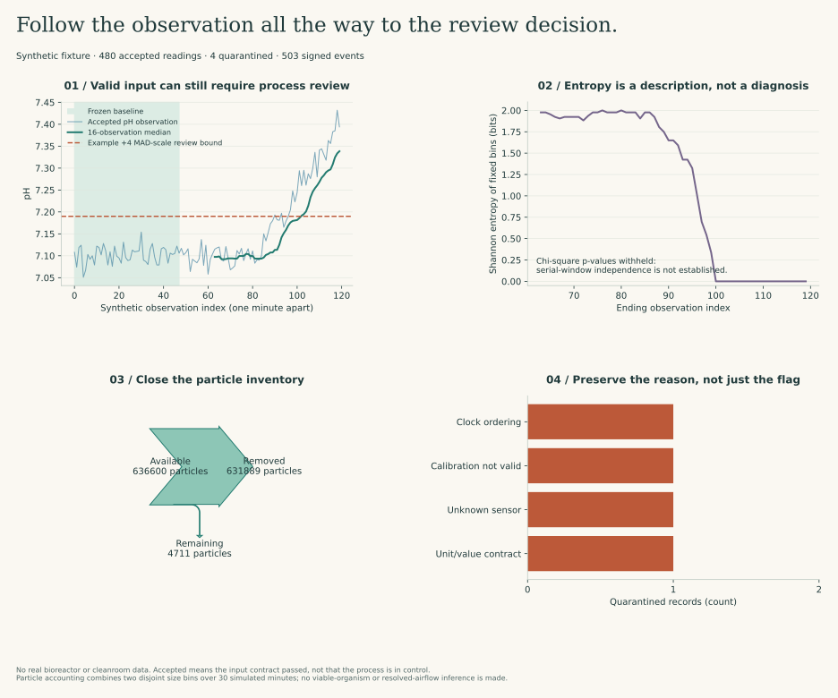

# From a sensor message to an inspectable facility record

I use this workflow to separate four questions that are too often collapsed into one green status: **Was the input admissible? Has the process changed? Can I verify the recorded decision? Does the physical model conserve what it claims to model?** Each question has a different test and a different limit.

The implementation runs end to end: a synthetic producer submits decimal-valued observations, a relational schema links them to assets and calibration records, a transaction stores each decision with a signed event, descriptive statistics inspect a frozen baseline, and a particle-balance model feeds a read-only inspection console. It sends no equipment commands.

<div class="route-buttons">
<a class="button" href="facility_console.html">Inspect the recorded facility</a>
<a class="button secondary" href="facility_schema.sql">Read the database schema</a>
<a class="button berry" href="../studies/results/facility.json">Inspect the evidence bundle</a>
</div>



## Run the complete workflow

```bash
python -m pip install -r requirements-torch.txt
python -m biotech.facility_demo --directory artifacts/my-facility-run
python -m studies.facility_figures
python -m biotech.facility_api --database artifacts/my-facility-run/facility.sqlite --attestation artifacts/my-facility-run/attestation.json
```

Open the loopback address printed by the API. The console also works from the built learning site using the recorded snapshot, but labels that mode separately. Database mode performs fresh signature and projection checks; snapshot mode displays the verification recorded when the fixture was generated.

Use a new directory for each run. The generator refuses to replace an existing database or attestation. The signing key exists only in memory and is not exported; reopening a database for further mutation requires an explicit signing identity. Read-only inspection needs only the public verification material.

The current fixture produces **480 accepted observations, four quarantined observations, and 503 signed application events**. One duplicate delivery returns the original receipt without creating a second observation. These counts describe the fixture, not a manufacturing validation study.

## 1. Keep the observation contract smaller than the scientific claim

The ingestor accepts exactly five nonempty string fields: `event_id`, `sensor_id`, `observed_at`, `value`, and `unit`. The receipt time is supplied separately. Decimal strings avoid introducing binary floating-point interpretation before normalization; explicit UTC offsets avoid ambiguous local clock times.

| Quantity | Declared input | Stored representation | Important distinction |
| --- | --- | --- | --- |
| pH | Decimal string, unit `pH` | Integer millipH, scale 1000 | Reporting resolution is not measurement uncertainty |
| Dissolved oxygen | `% air saturation` | Integer thousandths of percent | Percent saturation is not mg/L; values above 100% can represent supersaturation |
| Agitation | `rpm` | Integer rpm | A rotational rate is not a shear-stress measurement |
| Viable cell density | `10^6 cells/mL` | Integer cells/mL | A concentration estimate is not a direct count of every viable cell |
| Temperature | `degC` | Integer millidegrees Celsius | A valid temperature value does not establish cold-chain suitability |

The sensor-domain bounds are declared teaching contracts, not validated batch-release limits. Conversion uses round-half-even at a stated resolution. Original decimal text remains in the signed event envelope, so a reviewer can distinguish the submitted value from the normalized projection.

A well-formed message with an unknown sensor, wrong unit/value, future observation time, or absent valid calibration is retained in quarantine. It is not silently imputed, coerced into a plausible range, or deleted. Structurally malformed input is rejected before admission; this example does not claim a complete transport-error logging system.

## 2. Model the relationships that determine whether a value is usable

The [schema](facility_schema.sql) uses foreign keys, unique event identities, value-type checks, calibration lookup indexes, and explicit links to audit events.

| Table | Why I keep it separate | Link to the decision |
| --- | --- | --- |
| `facilities` | Geographic reference and source provenance | H3 is a facility-level index, not a cellular coordinate frame |
| `assets` | Bioreactors, rooms, and utilities have distinct identities | An observation belongs to a known physical context |
| `sensors` | The metric and unit contract belong to the instrument channel | A pH number arriving on an oxygen channel must not be reinterpreted |
| `calibrations` | Validity periods, uncertainty values, and certificate references are historical records | Exactly one applicable calibration must cover observation time |
| `maintenance` | Maintenance is an event, not an overwrite of current asset text | A reviewer can inspect what was recorded and when |
| `observations` | Accepted and quarantined records remain distinguishable | Analysis selects admitted data explicitly |
| `audit_events` | The original message, decision, actor label, and linkage are signed together | The receipt can be checked independently of a displayed table |
| `sample_links` | An accession and coordinate-frame claim need their own provenance | A reference link does not establish paired multi-omics measurements |

SQLite's type affinity alone is not a sufficient integer contract, so normalized values also have type checks. Accepted observations require a known sensor, normalized value, and calibration reference. Overlapping calibration intervals are rejected for reconciliation rather than resolved through an undocumented “latest record wins” rule.

Calibration validity uses the half-open interval `[valid_from, valid_until)`. Recording time is a separate required argument: I do not backdate the audit event to the calibration's validity start. Observation time and receipt time are also retained separately. A valid calibration record is still not proof that the sensor is accurate; certificate authenticity, traceability, uncertainty definition/coverage, installation, maintenance, and operating conditions need their own evidence.

## 3. Sign the decision, then check the materialized state

[The audit layer](audit_ledger.py) uses a versioned canonical envelope, SHA-256 linkage, and Ed25519 signatures. The payload protocol accepts bounded integers and explicit strings, not floating-point values or NaNs. Registration, calibration, maintenance/reference records, admitted telemetry decisions, and the analysis receipt generate signed events.

The observation row and its signed event share one transaction. The failure-injection test stops after both writes but before commit; rollback removes both. Reusing an event identity with changed content is rejected, while exact replay returns the original receipt.

I verify three distinct things:

1. **Envelope integrity:** the encoded payload still matches its hash and signature under a supplied trusted public key.
2. **History completeness relative to an anchor:** the final hash matches the expected head. A valid prefix alone cannot prove that later events were not removed.
3. **Projection agreement:** the current relational records match the projection digest included in the signed analysis event. Otherwise an intact event log could coexist with a modified observation table.

The inspection API also checks the external simulation/report bytes against the signed analysis digest before starting. Altering a graph's source report without updating a legitimate signed record is therefore detectable, rather than being hidden behind a reassuring “audit valid” badge.

These controls are **tamper-evident relative to trusted keys and anchors**, not physically unalterable storage. A local public-key/head file is a demonstration trust input, not an independently protected authority. A database administrator, compromised signing key, altered application, or false sensor input changes the threat model. The caller-supplied actor label is not authenticated human identity, and an Ed25519 signature is not by itself a regulated electronic signature with its required manifestation and meaning.

## 4. Distinguish data quality from process behavior

The pH series contains a seeded drift after a separate baseline segment. The input can be structurally valid and correctly calibrated under the fixture contract while its process distribution changes. I therefore keep ingestion status separate from the descriptive `drift_review` result.

The baseline uses 48 observations. Its quartile edges are frozen, with explicit underflow/overflow coverage, and subsequent 16-observation windows are examined without refitting those edges. I report sample variance, Shannon entropy in bits, median shift, and a robust scale based on `1.4826 × MAD`.

```text
H = −sum over occupied bins p_bin log₂(p_bin)
robust median shift = (median_current − median_reference) / (1.4826 × MAD_reference)
```

The factor 1.4826 is a normal-consistency scale convention, not a claim that the process is normally distributed. The example review bound of four robust-scale units is a declared teaching policy, not a validated false-alarm rate. Zero baseline MAD is surfaced explicitly rather than repaired with an arbitrary epsilon.

Because the reference distribution is estimated from data, the implementation uses a two-sample contingency-table comparison rather than pretending its expected probabilities are known exactly. Sparse expected cells and unestablished independence prevent reporting a chi-square p-value. The rolling, overlapping serial windows in this fixture do not meet the independence claim; p-values are withheld.

Entropy can change because of drift, bin placement, quantization, a stuck sensor, or a change in variability. It does not identify contamination. A useful contamination or yield-deviation model would need appropriate reference measurements, labels, sampling design, prospective evaluation, alarm burden analysis, and an investigation workflow. Those are not supplied by a statistical primitive.

## 5. Close the physical balance before animating the result

[The room model](airflow_dynamics.py) treats each room as well mixed, with prescribed pressure and clean supply air. An inter-room flow is derived from a declared conductance and pressure difference. Supply, exhaust, and inter-room flows must satisfy constant-volume air balance; inconsistent inputs are rejected.

For particle bin b in room i:

```text
dn_i,b/dt = generation_i,b
           + sum_j Q_j→i × n_j,b / V_j
           − (exhaust_i/V_i + sum_j Q_i→j/V_i + deposition_i,b) × n_i,b
```

Counts are modeled as continuous expected quantities. Flows are m³/h, room volumes are m³, deposition rates are per hour, and time is hours. Inter-room terms cancel when I sum over rooms. This yields the inventory check:

```text
initial particles + generated particles − removed particles − remaining particles ≈ 0
```

The recorded residual is approximately `2.9 × 10⁻⁹` particles in the smaller bin and `−7.1 × 10⁻¹²` in the larger bin. That is numerical balance, not a measurement of a real cleanroom. Tests also compare refinement against an analytic decay solution and reverse the pressure direction.

The state bins are **disjoint**: `0.5 ≤ d < 5 µm` and `d ≥ 5 µm`. Reported cumulative counts `d ≥ 0.5 µm` include both bins. Treating cumulative instrument channels as disjoint bins would double-count the larger particles.

The explicit time step must satisfy a positivity bound based on depletion rates. I reject an unstable step rather than clipping negative counts and quietly breaking conservation. Fixed-point observation storage does not make this floating-point differential-equation approximation bitwise identical across every platform.

The fixture uses a positive pressure cascade as an example, not a universal design rule. Product protection and biological containment can require different pressure strategies; a reversed direction must be considered in the context of the actual hazard and process. The reversal test checks the calculation, not the adequacy of either engineering strategy.

The console's Sankey-style links encode prescribed airflow. Its animation advances recorded concentration states; it does not depict resolved particle trajectories, air velocity, or laminar-flow vectors. ISO class labels, air-change rates, particle counts, viable organisms, and sterility are not interchangeable quantities.

## 6. Inspect without providing a control endpoint

The local server binds to `127.0.0.1`, opens SQLite read-only, limits pagination, and exposes no mutation endpoint. POST/PUT/PATCH/DELETE return 405. It is a review interface for a synthetic batch of evidence, not an internet-facing authenticated manufacturing service.

| Endpoint | Result |
| --- | --- |
| `GET /api/summary` | Asset list, accepted/quarantined counts, signed-event count |
| `GET /api/assets/{id}` | Sensor contracts, calibration history, maintenance, and reference links |
| `GET /api/observations?status=quarantined&limit=20&offset=0` | Bounded, ordered observation pages |
| `GET /api/events/{sequence}` | Signed envelope and original decision inputs |
| `GET /api/audit/verify` | Signature/head verification and signed-projection comparison |
| `GET /api/simulation` | The verified report's descriptive statistics and room-model states |

```bash
python -m pytest tests/test_facility.py tests/test_facility_api.py -v
python -m scripts.check_facility_browser --directory artifacts/my-facility-run
```

Browser checks exercise calibration/maintenance inspection, quarantine filtering, pagination, signed-event display, keyboard-accessible room nodes, playback, reduced motion, and mobile layout.

## Requirement-to-evidence map

These are local engineering identifiers, not regulatory certification labels.

| Contract | Acceptance evidence | Remaining deployment work |
| --- | --- | --- |
| OBS-01: preserve units, precision, and clocks | Fixed-point/timestamp tests and signed original message | Instrument interfaces, synchronized/trusted clocks, validated conversion procedures |
| CAL-01: use the applicable calibration | Expiry-boundary, overlap, recording-time, and foreign-key tests | Certificate verification, traceability, uncertainty budget, retrospective impact assessment |
| AUD-01: bind a decision to its source | Atomic rollback, changed-payload, signature, and head-anchor tests | Protected keys, authenticated roles, retention, backup/restore, independent anchoring |
| PROJ-01: detect divergent displays | Materialized-table tampering and unsigned-report rejection tests | Access control, monitored administration, validated review procedures |
| SIM-01: conserve the modeled quantity | Inventory residual, positivity, pressure reversal, analytic convergence | Measured parameters, airflow visualization/CFD validation, viable-particle model where justified |
| API-01: constrain inspection behavior | Read-only methods, parameter validation, pagination and browser tests | Production authentication, authorization, TLS, tenancy, observability, security review |

## Regulatory and research context

The engineering controls relate to data-integrity concerns; they do not establish compliance by themselves. The [FDA's Part 11 scope/application guidance](https://www.fda.gov/regulatory-information/search-fda-guidance-documents/part-11-electronic-records-electronic-signatures-scope-and-application) distinguishes the applicability of electronic-record requirements and the underlying predicate rules. Intended use, validation, accountable personnel, security, retention, review, and procedures remain essential.

The European Commission's [Volume 4 index](https://health.ec.europa.eu/medicinal-products/eudralex/eudralex-volume-4_en) identifies the published Annex 11 revision. The [2025 consultation](https://health.ec.europa.eu/consultations/stakeholders-consultation-eudralex-volume-4-good-manufacturing-practice-guidelines-chapter-4-annex_en) separately identifies draft revisions and a proposed AI annex; I do not silently treat a consultation draft as an operative requirement.

For aseptic-processing context, the [FDA guidance](https://www.fda.gov/regulatory-information/search-fda-guidance-documents/sterile-drug-products-produced-aseptic-processing-current-good-manufacturing-practice) emphasizes qualification and monitoring under relevant operating conditions. A well-mixed simulation and an air-change calculation cannot replace those studies.

## What is intentionally outside this implementation

There is no whole-genome autocomplete, mutation/evolution predictor, causal multi-omics generative twin, autonomous bioreactor control, validated cold-chain or yield model, activation-steering governance engine, WebGPU solver, or proprietary instrument integration. The interface renders SVG, not WebGPU. The molecular accession is a reference link, explicitly marked as not measured in the reactor and not spatially registered.

A scientifically defensible expansion would start with an intended-use specification, measured data and uncertainty, a risk assessment, independently testable acceptance criteria, and a validation plan. I would add complexity only where it answers a question that this smaller workflow cannot answer.
