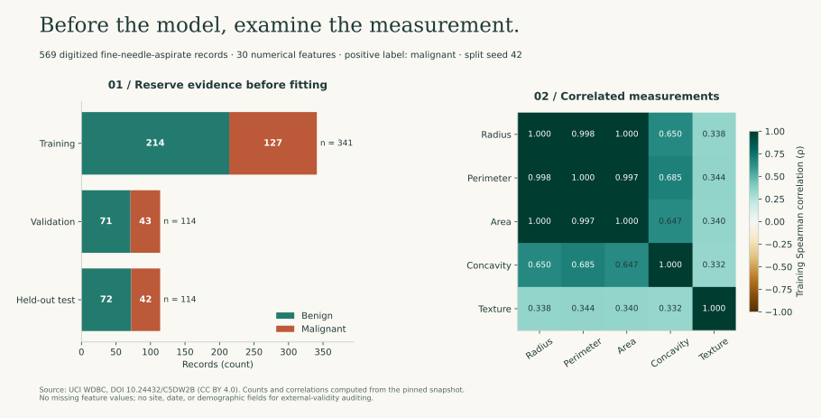
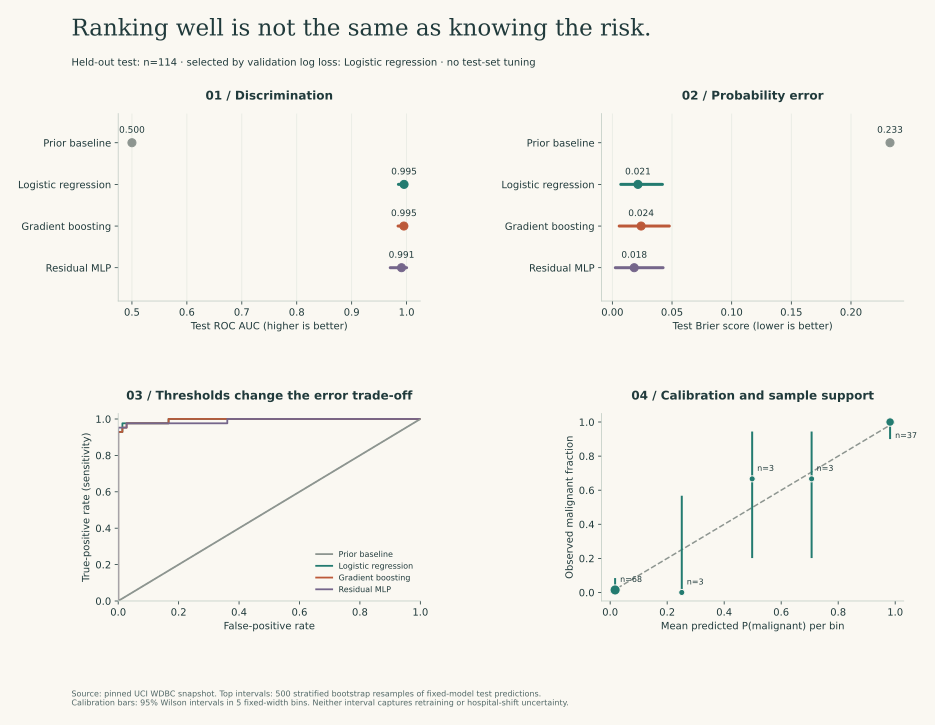
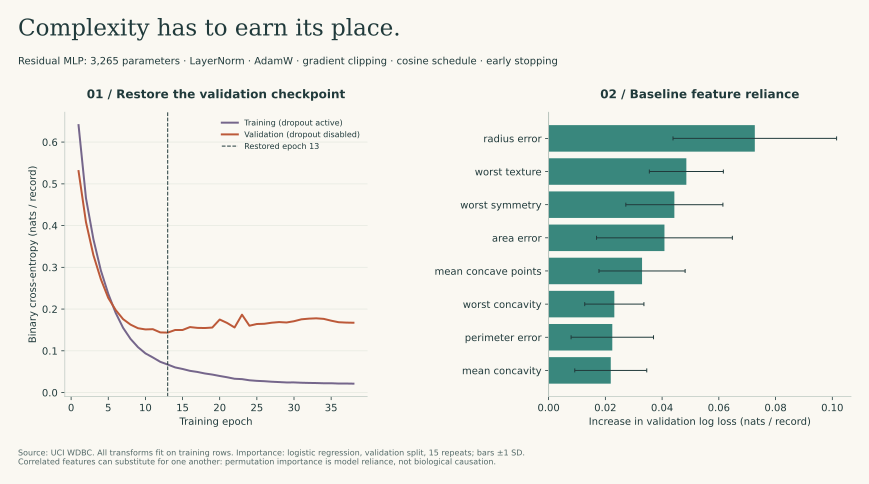

# When a simpler model is the better-supported decision

I begin with a deliberately narrow question: **given the published Wisconsin diagnostic image features, how well can a fixed set of models distinguish malignant from benign records in a held-out subset?** It is not a screening study, a survival model, or a prospective clinical evaluation.

That boundary matters. A model can perform exceptionally on a familiar benchmark while telling us very little about a different hospital, acquisition process, or patient population. I use this experiment to compare implementations and statistical decisions; I would need a different study before making a deployment claim.

## Begin with what was measured



The [UCI source](https://archive.ics.uci.edu/dataset/17/breast+cancer+wisconsin+diagnostic) contains 569 records: 357 benign and 212 malignant. Thirty numerical features describe cell nuclei in digitized fine-needle-aspirate images. The acquired table has no missing feature values and no duplicate feature rows. Identifiers are excluded from the predictors.

Radius, perimeter, and area are strongly related measurements. This is not automatically a reason to delete them, but it changes how coefficients and feature importance should be interpreted. A permutation result can be small because another correlated feature carries similar information—not because the biological quantity is unimportant.

The figure uses **training rows only** for feature correlations. There is no invented physical unit attached to a source field whose units are unspecified. Full attribution, observation definitions, source hashes, and transformations are in [data provenance](../data/README.md).

## Fix the evaluation contract before comparing models

A seeded stratified split reserves **341 training, 114 validation, and 114 test records**. Split indices and a split hash are recorded with the results. No record belongs to more than one partition.

- Scaling is fitted on training rows only. Within baseline cross-validation, the scaler is refitted inside each training fold through a scikit-learn `Pipeline`.
- The three classical baselines use the same five stratified training folds, scored by log loss. Fold-level values are retained rather than summarized as a fabricated confidence interval.
- Model family selection uses **validation log loss**. The neural network also uses that validation partition for checkpoint selection, so its validation score is a selection statistic, not an unbiased performance estimate.
- The decision threshold is fixed at **0.5**, not optimized on the test set. No threshold here is recommended for clinical practice.
- Test predictions are generated for transparent comparison, but the selected family remains the one chosen by validation. Looking at a more flattering test metric afterward does not change that rule.

There are no dates, site labels, or verified repeated-patient group identifiers available for a stronger split. I therefore do not call this temporal, external, or patient-group validation. The separate [patient-leakage exercise](../Core-algorithms/patient_leakage_lab.py) demonstrates why that distinction matters.

## Four models with different reasons to exist

| Model | Deliberate role | Fixed choices |
| --- | --- | --- |
| Class-prior baseline | Establish whether the features add information beyond prevalence | Training-class prior; no feature learning |
| Logistic regression | A regularized linear reference with probability outputs | Train-only standardization; L2 regularization, C=1 |
| Histogram gradient boosting | Test nonlinear interactions without a neural architecture | 100 iterations; at most 7 leaves; L2=1; no hidden internal early-stopping split |
| Residual tabular MLP | Examine a controlled neural training pipeline | 32-wide residual block; LayerNorm, GELU, dropout; 3,265 parameters |

The MLP is not granted a win for being more elaborate. Its [training implementation](modeling.py) uses a seeded minibatch generator, `BCEWithLogitsLoss`, AdamW, finite-loss checks, gradient clipping, cosine learning-rate decay, and early stopping. It deep-copies the best state dictionary rather than retaining a reference that changes during later updates. Prediction runs in evaluation and inference mode.

The CPU run is deterministic within the tested environment. That is not a guarantee of bitwise equivalence across PyTorch versions, CPUs, or accelerator kernels. Software versions and device are recorded. A checkpoint includes the feature ordering, scaler statistics, configuration, source hash, and best epoch. It is a local experiment artifact, not a clinical model release.

The MLP does not receive the same five-fold analysis as the classical baselines in this bounded implementation. A stronger family comparison would repeat the entire selection procedure, including neural early stopping, across nested splits and multiple training seeds. I would do that comparison before treating this single split as a stable ranking of model families.

## Results: ranking, probability error, and calibration answer different questions

<div class="interactive-results"></div>



The recorded seed-42 run selected **logistic regression** by validation log loss (0.0717). The following values are computed from the 114 held-out test records, with malignant as positive class:

| Model | ROC AUC ↑ | Average precision ↑ | Brier score ↓ | Log loss ↓ |
| --- | ---: | ---: | ---: | ---: |
| Class-prior baseline | 0.5000 | 0.3684 | 0.2327 | 0.6581 |
| Logistic regression | 0.9954 | 0.9936 | 0.0214 | 0.0789 |
| Gradient boosting | 0.9950 | 0.9930 | 0.0241 | 0.0887 |
| Residual MLP | 0.9907 | 0.9898 | 0.0183 | 0.0958 |

The neural model has a lower test Brier score but a worse test log loss than logistic regression. That is not a contradiction: log loss penalizes confidently incorrect probabilities much more severely. The predeclared validation rule still chooses logistic regression. This run does not establish a statistically significant ordering among the three feature-based models.

Average precision is the scikit-learn stepwise precision–recall summary, not an unspecified trapezoidal “PR AUC.” ROC AUC measures ranking, not calibration or a decision threshold. Brier score is mean squared probability error, combining calibration and discrimination effects; it is not a pure calibration statistic.

### What the intervals include

The top panels use 500 seeded **stratified row-bootstrap resamples of fixed-model test predictions**, with 2.5th and 97.5th percentiles. They preserve the observed class counts, so they condition on the observed prevalence. This is why the constant prior baseline can have a degenerate interval. The intervals do not include retraining variability, hyperparameter search, correlated repeated observations, or hospital shift.

The calibration panel uses five fixed-width probability bins. Error bars are 95% Wilson intervals for each bin's observed malignant fraction; marker size and annotations expose support. Three middle bins contain only three records each. Their large uncertainty matters more than whether a short plotted line appears near the diagonal.

### The threshold creates actual errors

For the selected logistic model at threshold 0.5:

| Actual diagnosis | Predicted benign | Predicted malignant |
| --- | ---: | ---: |
| Benign | 71 | 1 |
| Malignant | 2 | 40 |

The two false negatives and one false positive are not interchangeable clinical consequences. This benchmark has no validated action policy or cost model from which to choose a clinically acceptable threshold.

A limited slice check uses the **training median of mean radius (13.34 in source units)**. Below it, the test subset has 56 records and only two malignant labels, with Brier score 0.0052. At or above it, there are 58 records and 40 malignant labels, with Brier score 0.0371. That difference is not a fairness result: the groups have very different case mixes, and radius is itself a predictor. No demographic audit is possible from absent demographic fields.

## Read the training curve before celebrating the final epoch



The MLP continues reducing its training loss after validation loss has stopped improving. The stored model comes from **epoch 13**, not the last epoch executed. Training loss is measured while dropout is active; validation loss is measured with dropout disabled, another reason not to treat their pointwise gap as a perfectly isolated estimate of overfitting.

The importance panel perturbs one feature at a time in the validation set and measures the increase in logistic-model log loss. Whiskers show **one standard deviation across 15 permutations**, not confidence intervals. Correlated predictors and implausible permuted combinations limit causal interpretation. Nothing in this panel shows that changing a nucleus measurement would change a diagnosis.

## Inspect the code and the evidence

```bash
python -m studies.data
MPLBACKEND=Agg OMP_NUM_THREADS=1 python -m studies.run
python -m pytest tests/test_studies.py -v
```

- [Implementation](modeling.py): preprocessing, baselines, neural optimization, model selection, uncertainty, slices.
- [Recorded benchmark](results/benchmark.json): configuration, data/split hashes, full metrics, fold scores, learning curves, and package versions.
- [Held-out predictions](results/test_predictions.csv): source row, true label, and every model's probability.
- [Figure generation](figures.py): plotting decisions, labels, uncertainty calculations, and source captions.

These are measured results from the pinned snapshot and configuration, not example numbers typed into a chart. Regenerating the experiment with a different configuration creates a different experiment; update the narrative only after reviewing the changed outputs. Repeatedly tuning against this now-visible test set would invalidate its role as fresh held-out evidence.

## What this study supports

For this fixed benchmark and selection rule, a regularized linear baseline is the better-supported starting point. The neural implementation remains useful for learning optimization and checkpoint discipline, not as evidence that deep learning is necessary here. The larger unanswered question is external validity, not squeezing another decimal place from a familiar dataset.

Before any clinical claim: obtain an appropriately governed external cohort, verify prediction-time feature availability and patient independence, predefine the decision task and harm model, evaluate calibration and subgroup performance, and involve domain and clinical reviewers. Those are missing studies, not boxes that this repository's unit tests can tick.

**Primary data citation:** Wolberg et al. (1993), *Breast Cancer Wisconsin (Diagnostic)*, UCI Machine Learning Repository, DOI [10.24432/C5DW2B](https://doi.org/10.24432/C5DW2B), CC BY 4.0. Implementation practices: [scikit-learn common pitfalls](https://scikit-learn.org/stable/common_pitfalls.html). The wider repository's literature notes are reading material, not additional validation of this experiment.
