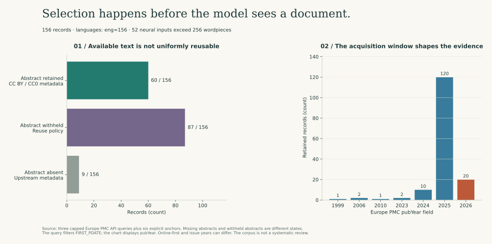

# Find the paper, then decide what it actually supports

I often need a method before I need another model: a reporting guideline, a definition of a quality score, or a paper explaining why an evaluation procedure is biased. Retrieval can help me find that material, but a relevant-looking paragraph is not yet usable evidence.

This study follows the complete path from a bounded public API acquisition to a local citation search. I compare a lexical baseline, a frozen text encoder, a lower-precision copy of that encoder, and a rank-fusion method. I measure ordering, latency, and storage together, then keep the corpus-selection limits next to the results.

## The workflow, in terms of inputs and outputs

| Step | Input | Output | Decision I can make |
| --- | --- | --- | --- |
| Acquire | Three declared Europe PMC queries and six explicit anchor DOIs | [Corpus and request manifest](../data/literature_evidence/manifest.json) | What was retrieved, from which query, and under which reuse rule? |
| Normalize | API metadata and reusable abstract text | Stable identifiers, clean presentation text, notice links, missingness states | Is there enough information to index and cite the record? |
| Index | The same title-plus-permitted-abstract strings | Sparse TF-IDF vectors or normalized 384-dimensional embeddings | Which representation fits this retrieval task and budget? |
| Compare | Six authored known-item questions | [Ranks and measured costs](results/evidence_retrieval.json) | Which failure cases deserve inspection? |
| Inspect | Ranked source records | Citations and editorial-notice links, not generated answers | What should I read and verify before applying a method? |

The output does not become an automated scientific conclusion. I still need to check the study population, assay, species, design, limitations, and whether the cited method supports the proposed use.

## Acquire through the intended service, not through a publisher crawler

[Europe PMC's copyright guidance](https://europepmc.org/copyright) distinguishes approved automated services from prohibited systematic downloading through its website. I use its [REST API](https://europepmc.org/restfulwebservice), not a crawler following article-page links or scraping full texts.

The client declares three queries, limits each to two pages of 25 records, waits between requests, bounds response size and retries, and stops rather than ignoring a long server retry requirement. It does not work around access controls. Query strings, response hashes, retrieval time, hit counts, and cursor positions are retained.

The six teaching anchors are then fetched by DOI and explicitly added. Their presence is therefore guaranteed by construction. That makes this a useful diagnostic collection, **not a systematic review or an unbiased sample of biomedical literature**.

Abstracts are retained only when the API supplies `cc by` or `cc0` license metadata. Otherwise the record remains title/metadata-only. Free access, a PMCID, or an “open access” label is not treated as interchangeable with an explicit reuse permission. Raw response bodies containing other fields are not republished; author affiliations and contact information are not extracted into the corpus.



The snapshot contains **156 records**, all labeled English by the provider. Sixty abstracts are included, 87 are withheld under the reuse policy, and nine are absent upstream. Those last two states have different causes and should not be combined into an unexplained null column.

A small date detail also matters: the query filters `FIRST_PDATE`, while the chart uses the API's `pubYear` field. Online-first and issue years can differ. For example, [MED:41039041](https://europepmc.org/article/MED/41039041) reports first publication on 2025-10-02 and `pubYear=2026`. A later issue year is not automatically evidence that the acquisition ignored its first-publication window.

## What changes between the four retrieval methods?

| Method | Representation and score | What changes | What does not change |
| --- | --- | --- | --- |
| TF-IDF | L2-normalized word/unigram-bigram vectors; sparse cosine similarity | Corpus vocabulary and inverse document frequencies | No neural model or supervised relevance training |
| MiniLM FP32 | Pinned sentence encoder, attention-masked mean pooling, L2 normalization | A pretrained text representation is used | All pretrained parameters remain frozen |
| MiniLM INT8-linear | Dynamic INT8 conversion of linear layers in the same checkpoint | Numerical weight/operator representation | No biological facts are learned and no relevance fine-tuning occurs |
| Hybrid RRF | Sum of reciprocal rank contributions from TF-IDF and FP32 | The ordering combines two retrieval systems | Scores are not added as if they had the same meaning |

The model is [all-MiniLM-L6-v2](https://huggingface.co/sentence-transformers/all-MiniLM-L6-v2), pinned to revision `1110a243fdf4706b3f48f1d95db1a4f5529b4d41` with a checked publisher weight hash. It is a compact English text encoder, **not a generative clinical LLM**. I load local safetensors, disable remote model code, and keep large weights outside the source tree.

Pooling follows this model's documented contract: padding is excluded through the attention mask, while ordinary special tokens participate as specified by the model-card example. I do not substitute the protein-study pooling rule merely because the tensor shapes look similar. Different pretraining objectives can require different representation contracts.

The neural methods cap input at 256 wordpieces. In this corpus, **52 records exceed that limit**. TF-IDF uses the full supplied text. Thus the lexical-versus-neural comparison evaluates complete pipelines with different representation constraints; it does not isolate only a weight matrix. FP32 versus INT8-linear uses the same tokenizer and length limit, making that comparison more focused.

The pinned PyTorch 2.8 quantization path is version-specific and emits upstream deprecation/backend warnings. This run uses QNNPACK on arm64. A future migration to another quantization API or backend needs a new parity and performance check; I do not treat the current timings as portable hardware facts.

## Read the result at the level the labels support

Each question names one known source paper through an authored target judgment. Other returned papers may also be relevant. I therefore report **known-target hit@5** and **mean anchor reciprocal rank**, not full recall or a claim that every other paper is irrelevant.

```text
known-target hit@5 = fraction of authored questions whose target appears in the first five results
anchor reciprocal rank = 1 / target rank, or 0 if absent
RRF(document) = sum over retrieval systems 1 / (60 + rank_system(document))
```

The rank-fusion constant is fixed, not tuned against these six questions. RRF combines rank positions because lexical and embedding scores are not calibrated onto a common scale. Neither score is a probability that an article is correct.


The recorded local run gives:

| Method | Known targets in top 5 | Mean anchor reciprocal rank | Warm p50 | Warm p95 | Serialized neural state |
| --- | ---: | ---: | ---: | ---: | ---: |
| TF-IDF | 5/6 | 0.5135 | 0.53 ms | 0.72 ms | None |
| MiniLM FP32 | 5/6 | 0.8611 | 8.77 ms | 12.09 ms | 90.89 MB |
| MiniLM INT8-linear | 5/6 | 0.8485 | 12.06 ms | 13.26 ms | 58.63 MB |
| Hybrid RRF | 5/6 | 0.6944 | 9.33 ms | 13.92 ms | 90.89 MB |

The encoder improves the ordering of several targets, but not every question. TF-IDF puts the original decision-curve paper first, while FP32 places it sixth. Conversely, FP32 retrieves the reporting-guideline anchor first, where TF-IDF places it twenty-first. A single aggregate score would conceal which reader needs each method helps or misses.

INT8-linear reduces serialized neural state by about **35.5%**, not fourfold, because embeddings and other operations remain floating point. On this machine its median query time is slower than FP32. Compression is therefore not evidence of a latency win. The hybrid also does not automatically outperform its inputs in this diagnostic set.

These are observations from a small, authored collection. I would not select an enterprise search architecture from six known-item tasks. A stronger evaluation needs representative user questions, blinded relevance judgments, more than one relevant document where appropriate, adjudication, query slices, and an untouched evaluation set.

## Measure the cost that the deployment would actually pay

Timing includes query tokenization/encoding and ranking against the already-built index. Each method receives 72 measured requests; query and method order are shuffled between repeats after warm-up. The run is single-threaded CPU on Darwin arm64. Network acquisition, package import, cold loading, concurrent requests, and human review are excluded.

The report separately records model loading/conversion time, index-building time, numeric index storage, and serialized model-state size. Serialized bytes are **not process RSS**: they omit runtime buffers, vocabulary/metadata overhead, allocators, and other service components. The CLI search command rebuilds its index on each invocation, so its elapsed time should not be compared directly with the warmed benchmark.

The workload projection multiplies observed mean query time by an explicitly assumed 10,000 requests. It is an arithmetic scenario for this corpus and query mix—not a throughput SLA, capacity model, or monetary estimate. Real operational value also depends on review effort, missed evidence, update frequency, licensing work, and the cost of an incorrect scientific decision.

## Follow bias to the stage where it enters

| Stage | Distortion or risk | What I expose | What would require more evidence |
| --- | --- | --- | --- |
| Question construction | Six questions were written around known methods | Exact question text and target DOI | Representative, independently authored workload |
| Corpus selection | Three English queries, capped pages, provider ranking, explicit anchors | Query/cursor manifest and source audit | Sensitivity to query alternatives and broader coverage |
| Publication | Indexed literature is not all completed research | Provider/source scope, dates, publication types | Publication-bias assessment and trial/protocol linkage |
| Text availability | Rights policy and missing abstracts create unequal input depth | Separate retained/withheld/absent states | Licensed access and input-scope ablations |
| Representation | Uncased tokenization and truncation can lose distinctions | Model revision, pooling, length cap, truncation count | Domain-specific testing, including gene/drug notation |
| Pretraining | Scientific-text training sources may overlap the corpus | Model-card training sources and unresolved overlap | A meaningful overlap audit or temporally distinct evaluation |
| Ranking | Related language need not support the requested claim | Source identifiers and notice links, no generated conclusion | Full-text appraisal, study applicability, and human judgment |
| Performance | Warm local timing is not service behavior | Raw timing samples, hardware/runtime, workload assumptions | Load tests, cold paths, memory profiling, failure recovery |

Twenty-nine records have linked notices in provider metadata. Those links include comments and corrections; they are not all retractions. I retain the notice type rather than flattening it into an unsupported validity verdict. Absence of a notice does not certify a paper, and a correction link does not automatically invalidate every finding.

## Run an actual query

```bash
python -m pip install -r requirements-retrieval.txt
python -m studies.evidence_retrieval --download-model
python -m studies.evidence_retrieval --query "How should I audit calibration and model reporting?" --method TF-IDF
python -m studies.evidence_retrieval --query "How should I audit calibration and model reporting?" --method "MiniLM FP32"
python -m studies.retrieval_figures
python -m pytest tests/test_evidence_retrieval.py -v
```

The retained corpus makes normal runs offline. `--download-model` is an explicit first acquisition of the pinned weights; later queries load local files. `--acquire` refuses to overwrite an existing corpus. The sparse query path does not require downloading neural weights.

A query returns identifiers, titles, authors, publication-year metadata, DOI, source links, scores, and notice links. It does not fabricate an answer or attach a citation to a claim it has not verified. A lexical query with no vocabulary overlap returns no results rather than presenting arbitrary zero-score ties as evidence.

## How this connects to the other studies

The [biotech QC chapter](../biotech/README.md) defines how I inspect an observation. The [statistical study](statistical_validation.md) defines how I compare evidence. The [protein adaptation study](protein_adaptation.md) inspects which weights change during learning. This retrieval study instead freezes a text model and changes its numerical representation. The [facility workflow](../biotech/facility_workflow.md) records decisions and assumptions at the process boundary.

These are connected reasoning patterns, not one combined clinical model. A paper citation does not become a calibration certificate, a protein embedding does not become a causal cellular simulator, and a signed decision does not become a scientifically correct decision merely because it is signed.

## Sources

- [Europe PMC REST API](https://europepmc.org/restfulwebservice), [developer access routes](https://europepmc.org/developers), and [copyright/reuse policy](https://europepmc.org/copyright).
- [MiniLM model card](https://huggingface.co/sentence-transformers/all-MiniLM-L6-v2): architecture, pooling, 256-wordpiece limit, English scope, Apache-2.0 license, and scientific-text training sources.
- Cormack, Clarke, and Buettcher (2009), *Reciprocal rank fusion outperforms condorcet and individual rank learning methods*, DOI [10.1145/1571941.1572114](https://dl.acm.org/doi/10.1145/1571941.1572114). I use its rank-fusion idea as a fixed comparator, not as a guarantee of improvement here.
- [Corpus records](../data/literature_evidence/corpus.json) retain per-article author/title/source attribution and license metadata; [authored questions](../data/literature_evidence/queries.json) identify the six anchors and the limited judgment scope.
