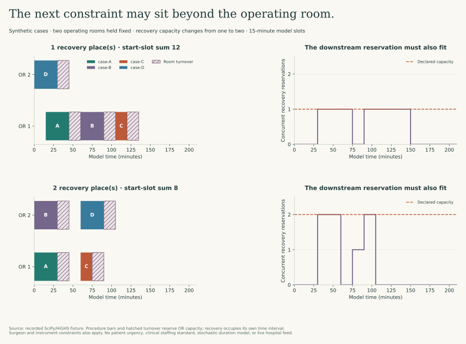

# A faster path still needs a clear contract

There are two kinds of efficiency I want to keep apart. One concerns the computation: which bytes move, which buffers are shared, and what work is repeated? The other concerns the system around it: which resource is occupied, for how long, and whose needs the objective represents?

These examples are small enough to inspect closely. The first verifies CPU memory-sharing boundaries. The second solves a synthetic resource-scheduling problem and checks its constraints. Neither uses patient data or controls a clinical workflow.

## 1. Ask exactly where the copy disappears

The [data-movement implementation](data_movement.py) writes a synthetic float32 array with one million rows and two columns—8 MB of numeric data, not a terabyte-scale imaging benchmark.

It then checks six claims directly:

| Operation | Recorded result | Interpretation |
| --- | --- | --- |
| Basic NumPy slice | Shares memory | A view can retain the original buffer |
| Advanced integer indexing | Does not share memory | Selection creates a new array even when the values resemble a slice |
| Float32 → float64 conversion | Does not share memory | `copy=False` cannot make incompatible representations occupy the same bytes |
| `torch.from_numpy` on the writable CPU view | Same starting data pointer | The tensor and view alias the same CPU storage |
| Write through the tensor | Visible in the NumPy view | Sharing is a mutability contract, not only a speed feature |
| Reopen the source file | Original value preserved | Copy-on-write isolates disk content, while still allowing local alias changes |

I use copy-on-write mapping rather than pass a read-only array to a mutable tensor. [PyTorch warns](https://docs.pytorch.org/docs/2.14/generated/torch.from_numpy.html) that writing through a tensor backed by a read-only NumPy array is unsupported. The implementation is tested against this repository's pinned PyTorch version.

A spawned reader receives the file path, maps it read-only, and returns a small scalar result. It does not receive the entire array through a Python object queue. Summing the index column gives **499,999,500,000**, matching the analytic result `n(n−1)/2` for `n=1,000,000`.

That verifies the transfer contract. It does not prove that all work is free: mapping still involves virtual-memory management and possible page faults; changing private mapped pages can copy them; process startup and imports take time. The recorded elapsed measurement includes spawning, mapping, reduction, and return. It is not a standalone read-bandwidth or sub-millisecond inference claim.

```bash
python -m studies.data_movement
python -m pytest tests/test_execution_contracts.py -v
```

The [recorded output](results/data_movement.json) preserves the boolean checks, shape, analytic reference, environment, and timing scope. [NumPy's memory-mapping documentation](https://numpy.org/doc/stable/reference/generated/numpy.memmap.html) explains its modes and lifetime caveats.

### Carry the meaning along with the buffer

Sharing storage does not preserve feature meaning automatically. A model still needs the correct feature order, units, preprocessing, and dtype. That is why the [export/inference example](engineering.md) keeps schema and preprocessing checks beside the model, rather than treating an array of the right shape as sufficient evidence.

This is CPU sharing on one host. It is not a direct GPU ingest implementation, a cross-host shared address space, a DICOM decoder, or a guarantee that Polars/Arrow conversions avoid allocation. Those boundaries require their own measurements.

## 2. Make the unavailable resource visible

The [scheduling model](resource_scheduling.py) uses four fictional cases, two operating rooms, assigned surgeon/teams, named instrument sets, room-turnover intervals, and post-anesthesia recovery capacity. Time is discretized into illustrative 15-minute slots.

For every admissible case–room–start combination, I create a binary decision variable. Exactly one placement must be chosen for each case. The model reserves:

- the operating room during the procedure **and** its turnover interval;
- the assigned surgeon/team during the procedure;
- the instrument set until its declared turnaround interval ends;
- recovery capacity from procedure completion until the end of the recovery interval.

The instrument delay is an availability placeholder, not a sterilization protocol or a claim that a tray is sterile after a certain number of minutes.

```text
minimize sum of start slots across cases
subject to:
  exactly one placement per case
  each exclusive resource occupied at most once per slot
  recovery occupancy no greater than the declared capacity
  all reservations inside the modeled horizon
  binary placement variables
```

[SciPy's MILP interface](https://docs.scipy.org/doc/scipy/reference/generated/scipy.optimize.milp.html) supplies the HiGHS solver. I request a zero relative optimality gap for this small fixture and do not label a time-limited, unproven result optimal. The returned assignments also pass a separate slot-occupancy check. For a smaller two-case example, tests compare the objective with exhaustive enumeration.



In the recorded comparison, allowing two rather than one recovery place reduces the sum of start slots from **12 to 8**, while the number of operating rooms remains two. Since the arrival windows are unchanged, that is a 60 case-minute difference in aggregate waiting under this particular model. It is **not** a claim of one hour less elapsed operating time, a hospital-wide productivity estimate, or a recommendation to reduce staffing.

The useful lesson is the relationship: an empty room is not automatically an available procedure slot when the downstream resource is already occupied.

```bash
python -m studies.resource_scheduling
python -m studies.execution_figures
python -m pytest tests/test_execution_contracts.py -v
```

The [result file](results/resource_scheduling.json) includes case inputs, assignments, solver status/gap, objective, capacity check, and measured solver time. Multiple schedules can have the same optimal objective; the particular room assignment is not a unique scientific finding.

## 3. Keep the objective open to review

The model minimizes unweighted start times. It contains no emergency priority, acuity, equity policy, staffing-safety standard, stochastic duration, transport delay, or real-time disruption response. A real hospital would need those assumptions defined with the people responsible for care and operations, not inferred from a solver's success status.

Adding capacity is also not simply changing an integer: it may require staff, space, equipment, cleaning, budget, and a different care pathway. Before projecting business impact, I would test realistic duration distributions, perturb the constraints, examine who waits longer, and compare against the actual operational baseline.

The [technology/interface map](technology_map.md) identifies the missing ADT, FHIR, DICOM, IHE, terminology, and CDS integration work. This optimizer does not receive those messages or write a clinical record. Its contribution is narrower: an inspectable proof that a schedule must account for the resources around the visible task.
