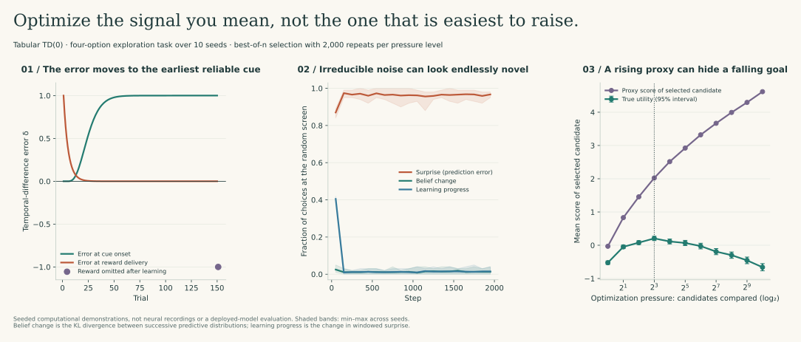

# Optimize the signal you mean

Every learning system follows a signal. A value function follows prediction error; a curious agent follows a novelty bonus; a fine-tuned model follows a reward model. The engineering question is not whether the signal can be raised. It is whether raising it still means what we intended.

I built three small demonstrations that make this concrete. Each is seeded, tested, and simple enough to inspect line by line. Together they show the same lesson from three directions: **a signal that is easy to increase can drift away from the outcome it was meant to represent.**



<div class="route-buttons">
<a class="button" href="learning_signals.py">Read the implementation</a>
<a class="button secondary" href="results/learning_signals.json">Inspect the recorded run</a>
<a class="button berry" href="evidence_contracts.md">Continue to evidence contracts</a>
</div>

## 1. Prediction error is a timing signal, not a pleasure signal

Temporal-difference learning updates a value estimate with the error

```text
δ_t = r_t + γ·V(s_{t+1}) − V(s_t)
```

I model a cue followed by five steps and a reward. Because the cue arrives at an unpredictable time, the state before it carries no expectation, and its value stays at zero.

In the [recorded run](results/learning_signals.json):

| Phase | Error at cue | Error at reward |
| --- | ---: | ---: |
| First trial | 0 | +1 |
| After learning | ≈ +1 | ≈ 0 |
| Expected reward omitted | ≈ +1 | ≈ −1 |

The error migrates to the earliest reliable predictor, and an expected-but-missing reward produces a negative error. This is the computational pattern reported for midbrain dopamine neurons by Schultz, Dayan, and Montague (1997). The lesson for engineering is precise: the signal reports *unexpectedness relative to a learned expectation*. A system that receives a steady positive error has not necessarily found something valuable; its expectations may simply be wrong or manipulated.

## 2. Surprise is not the same as learnable novelty

An exploring agent often receives an intrinsic bonus for observations it cannot yet predict. That works until it meets irreducible randomness—the “noisy TV” problem discussed for prediction-error curiosity methods such as ICM (Pathak et al., 2017) and RND (Burda et al., 2019).

The task has four options: a rewarded task option, two fixed landmarks, and a screen that shows one of 16 symbols uniformly at random. Each option keeps a categorical belief over what it will show. I compare three intrinsic signals, all weighted equally against a task reward of 0.5:

| Signal | Definition | Second-half time at the screen | Mean task return |
| --- | --- | ---: | ---: |
| Surprise | `−log p(observation)` before updating | **96%** | 14 |
| Belief change | KL divergence between successive predictive distributions | 1.4% | 964 |
| Learning progress | Change in windowed surprise (after Oudeyer et al., 2007) | 1.4% | 905 |

Averages are over ten seeds. Surprise from the screen stays near log 16 ≈ 2.8 nats forever, outweighing the task. Belief change and learning progress fall towards zero once the agent has learned that the screen is *uniformly* random. The model can become certain about its uncertainty.

That distinction—aleatoric randomness that cannot be reduced versus epistemic ignorance that can—matters well beyond reinforcement learning. A monitoring dashboard that rewards “unexplained variance” will keep pointing at a noisy sensor. An analyst who keeps chasing every surprising result in a high-variance assay is responding to the same trap.

The belief-change signal here is a predictive-distribution KL, not the full parameter-posterior information gain used in methods such as VIME. It is the smallest version that still separates the two kinds of uncertainty.

## 3. A proxy can keep rising after the goal turns down

Optimizing against a learned reward model is common in model fine-tuning. Gao, Schulman, and Hilton (2023) measured how true quality can fall as optimization against a proxy increases.

I reproduce the shape with a transparent toy. Each candidate has a quality component and a style component:

```text
proxy score  = quality + 1.0·style
true utility = quality − 0.5·style²
```

Moderate style helps the proxy without hurting much; extreme style hurts the real goal. I apply increasing optimization pressure by choosing the best of *n* candidates according to the proxy.

| Candidates compared | Proxy of selected | True utility of selected |
| ---: | ---: | ---: |
| 1 | −0.03 | −0.52 |
| 8 | 2.02 | **+0.21** |
| 64 | 3.32 | −0.02 |
| 1,024 | 4.62 | −0.66 |

The proxy rises monotonically across all eleven pressure levels. True utility peaks at eight candidates and then falls below its starting point. If I monitored only the proxy, the system would look like it was continuously improving. In language models, the analogous failures include verbosity, flattery, and confident fabrication—outputs that please a reward model without serving the reader.

Two practical controls follow. First, hold out a measurement of the real outcome that the optimizer never sees, and stop when it stops improving. Second, limit optimization pressure deliberately rather than treating “more search” as free.

## How this connects to the rest of the repository

The [statistical study](statistical_validation.md) keeps model selection outside the data used to evaluate it—the same separation between optimizing and measuring. The [evidence contracts](evidence_contracts.md) refuse to raise confidence when sources are missing or conflicting. The [biotech QC](../biotech/README.md) keeps noisy controls visible instead of letting a pooled average look reassuring.

## Run and verify

```bash
python -m studies.learning_signals
python -m studies.learning_figures
python -m pytest tests/test_learning_signals.py -v
```

The tests check that the TD error transfers to the cue and turns negative on omission; that surprise-seeking is trapped while belief change and learning progress escape across seeds; that runs are reproducible; and that the proxy keeps rising while true utility falls significantly below its peak.

## Scope

These are computational demonstrations with synthetic environments. They are not neural recordings, behavioural data, or an evaluation of any deployed model. The dopamine connection is a well-established analogy at the level of the error signal, not a claim that this code models neurochemistry.

## Sources

- Schultz, W., Dayan, P., & Montague, P. R. (1997). A neural substrate of prediction and reward. *Science*, 275(5306), 1593–1599.
- Pathak, D., Agrawal, P., Efros, A. A., & Darrell, T. (2017). Curiosity-driven exploration by self-supervised prediction. *ICML*.
- Burda, Y., Edwards, H., Storkey, A., & Klimov, O. (2019). Exploration by random network distillation. *ICLR*.
- Oudeyer, P.-Y., Kaplan, F., & Hafner, V. V. (2007). Intrinsic motivation systems for autonomous mental development. *IEEE Transactions on Evolutionary Computation*, 11(2), 265–286.
- Gao, L., Schulman, J., & Hilton, J. (2023). Scaling laws for reward model overoptimization. *ICML*.
- Background synthesis: K. Bala, *Effects of Dopamine on the Neuro-Biochemistry of Deep Learning* (2026), chapters 7–8, which survey these mechanisms. The implementations and results here are original.
