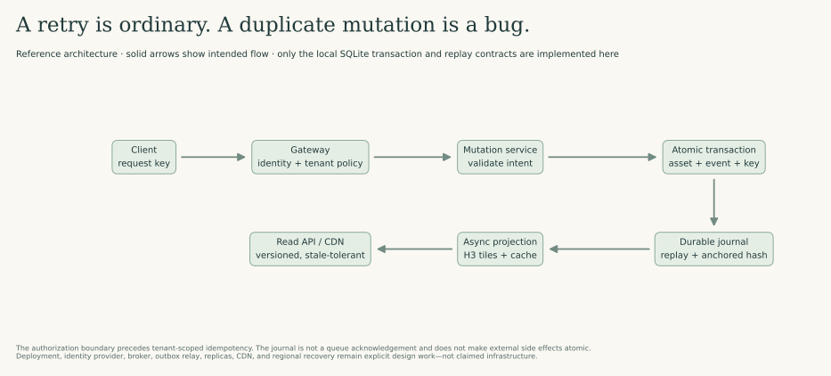
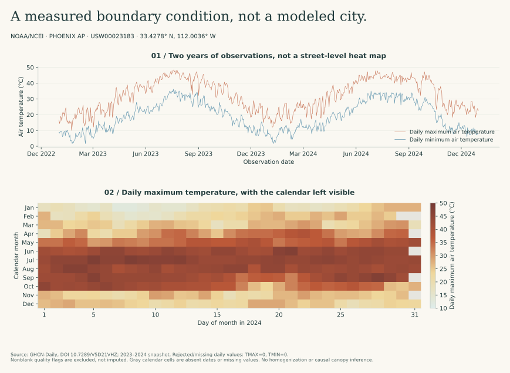
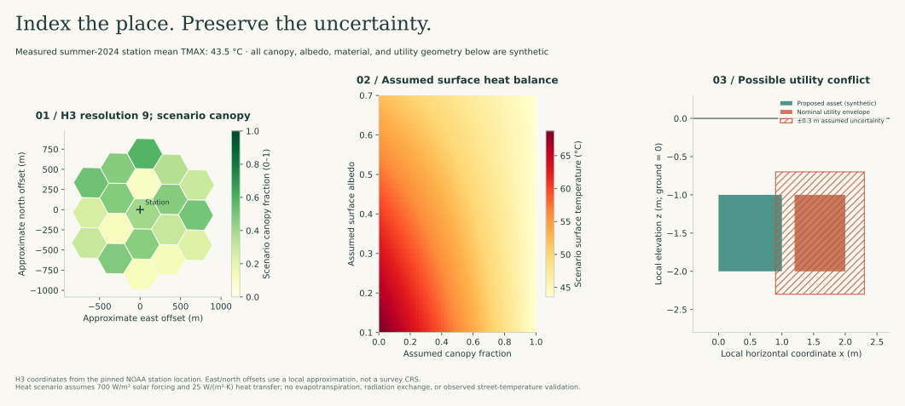

# A spatial twin is a state-management problem before it is a rendering problem

A tree-placement proposal looks simple on a map. In a working system it may cross several boundaries: a user changes canopy geometry, a worker recomputes a thermal scenario, a utility overlay flags a possible conflict, and a cached map updates later. The design problem is to preserve the meaning of that proposal through retries, partial failures, stale reads, and uncertain observations.

I use a reference design to connect those boundaries, then test the local contracts I can inspect directly. The transaction, replay, indexing, and geometry examples are executable. The deployment topology is a design to evaluate, not a claim of an operating production system. I link primary technical sources beside the decisions they support.



## Keep the observation and the counterfactual separate



The NOAA records establish an observed station-level boundary condition. They do not tell us how much a particular tree would cool a particular street. We therefore store three distinct kinds of information:

1. **Observation:** station, timestamp, variable, unit, raw value, quality flags, source version.
2. **Scenario:** geometry, material assumptions, canopy fraction, forcing, model version, and units.
3. **Decision:** proposed action, initiating identity, tenant, input hashes, model outputs, uncertainty, and review status.

A field called `temperature` without those distinctions is a design defect. The same number can mean measured air temperature, an assumed boundary condition, or a modeled surface temperature.



### H3 is the join key, not the final geometry

`studies.systems.spatial_cells` indexes a station location and its neighborhood at a declared H3 resolution. The demonstration uses resolution 9 and a bounded ring count; coordinates are latitude/longitude, not projected metres.

A useful production arrangement is an H3 candidate index plus authoritative vector geometry in a spatial database. Candidate lookup reduces work; precise intersections and distances still need appropriate geometry and coordinate reference systems. H3's parent-child relationship has exact logical containment but only approximate geographic containment across resolutions. It also includes pentagons: never assume every neighborhood behaves like an infinite planar hexagonal lattice. [H3 indexing documentation](https://h3geo.org/docs/highlights/indexing).

### A heat-budget example, with its missing physics visible

The implemented sensitivity calculation is:

```text
T_surface = T_air + (1 − albedo) × solar_flux × (1 − canopy_fraction) / heat_transfer_coefficient
```

Units are °C, W/m², and W/(m²·K), so the increment is a temperature difference. This is a simplified steady-state balance. The observed summer station mean is used as `T_air`; all remaining inputs are assumptions. Tests check dimensional intent, finite inputs, and monotonic responses, not agreement with street thermometers.

This is **not validated thermal downscaling**. It omits long-wave radiation, evapotranspiration, humidity, wind-dependent transfer, heat storage, sky-view factors, advection, and building geometry. A defensible next experiment would add a transient energy balance, measure those inputs, and validate against independent street-level observations. Do not label a scenario surface as “predicted city temperatures” without that work.

### Subsurface uncertainty belongs in the query

`Box` and `possible_clash` provide an axis-aligned 3D broad-phase test in a **local metric frame**. They expand envelopes by supplied survey uncertainty and required clearance. A nominal gap can therefore become a possible conflict. A positive result means “investigate further,” not “a pipe will rupture”; a negative result does not certify an incomplete utility inventory.

FHWA distinguishes utility information quality levels D through A, with different investigation methods. A quality level is not a universal numerical standard deviation. The example's ±0.3 m envelope is an assumed tolerance, not a conversion from a quality level. Real deployment needs survey provenance, vertical datum, positional uncertainty, precise pipe/asset geometry, and professional review. [FHWA SUE guidance](https://www.fhwa.dot.gov/programadmin/sueindex.cfm).

## The retry experiment

The local `MutationJournal` stores an asset change, its idempotency key, and an event in **one SQLite transaction**. Keys are scoped by tenant. Reusing a key with an identical intent returns the stored event hash; reusing it for a different intent is rejected.

```python
from studies.systems import MutationJournal

journal = MutationJournal(":memory:")
try:
    first = journal.apply("demo-city", "proposal-42", "tree-7", {"canopy": 0.3})
    replay = journal.apply("demo-city", "proposal-42", "tree-7", {"canopy": 0.3})
    assert replay["replayed"]
    assert first["event_hash"] == replay["event_hash"]
    assert journal.state() == journal.reconstructed_state()
finally:
    journal.close()
```

The meaningful tests also inject failure between the asset write and commit, attempt conflicting key reuse, and alter a journal payload. They inspect state, not just return codes. A transaction rollback must remove both the state change and the corresponding event; a retry after rollback must be allowed to succeed.

The hash chain uses explicitly ordered, serialized event envelopes. It is tamper-evident **relative to a trusted head hash**, not immutable in the face of a database administrator who can rewrite the whole history. Chain verification without an externally trusted head cannot detect suffix deletion or complete rewriting. Deterministic serialization is a local protocol here, not a cross-language canonical-JSON standard. Regulatory compliance additionally needs identity, access controls, retention policies, trusted timestamps, external anchors/signatures, and audit procedures.

No email, payment, external API, or broker publication occurs in this transaction. Such side effects require an outbox/inbox or another explicit coordination design. Idempotency is not a claim of global exactly-once delivery. [AWS: making retries safe with idempotent APIs](https://aws.amazon.com/builders-library/making-retries-safe-with-idempotent-APIs/).

## All 25 core concepts, applied to one design

The decisions below are proposals to evaluate. “Test” describes the evidence required, not an assertion that every distributed component is implemented.

| Concept | Concrete design decision | Failure or measurement that would challenge it |
| --- | --- | --- |
| Scalability | Partition expensive scenario jobs by tenant, region, and scenario version; scale workers independently from reads. | Increase arrival rate until queue age rises; identify the actual bottleneck. |
| High availability | Redundant stateless API instances and a database topology chosen for a stated service-level objective. | Remove an API instance during sustained traffic; measure success rate and tail latency. |
| Fault tolerance | Bound dependencies with deadlines, queues, and retry budgets; preserve the committed event. | Terminate a worker after commit but before acknowledgement. |
| Latency | Separate interactive reads from slow simulations; define p50/p95/p99 by endpoint. | Inject a slow spatial dependency; ensure the UI receives a pending status, not an indefinite request. |
| Throughput | Measure accepted mutations and completed scenarios separately. | Saturate compute while confirming that inexpensive reads remain within budget. |
| Load balancing | Health-aware distribution across API instances, with graceful draining. | Drain an instance carrying active requests without duplicating writes. |
| Caching | Key derived tiles by tenant, cell, scenario, and model/data version. | Request two tenants with identical cell IDs; check isolation and invalidation. |
| CDN | Publish only public, versioned assets; keep sensitive/private records out of shared caches. | Verify cache headers and authenticated-response exclusions. |
| DNS | Treat DNS caching and failover time as part of recovery, not instant routing. | Exercise resolver TTL behavior during an endpoint change. |
| API design | Separate immutable scenario submissions, status reads, and approved mutations; specify units and version fields. | Replay an old-schema request and reject ambiguous unit conversions. |
| REST | Use resource identifiers, explicit status codes, conditional updates, and idempotency keys for retryable POST operations. | Return a timeout after commit, then resend the same key. |
| SQL vs NoSQL | Keep transactional asset/event state relational; put large immutable meshes in object storage. | Demonstrate that a mesh-store outage does not corrupt a committed relational decision. |
| Indexing | Composite tenant/resource indexes plus H3 candidate lookup and exact geometry filtering. | Inspect query plans and false-positive candidate counts at dense sites. |
| Replication | Define which reads may use lagging replicas and which need read-your-writes. | Pause replication and verify that a newly committed proposal is not reported missing. |
| Sharding | Avoid hot geographic shards by including tenant/workload considerations; document resharding. | Load a dense urban cell and test skew rather than uniform synthetic keys alone. |
| CAP theorem | During a partition, choose explicitly whether authoritative mutations reject or wait to preserve consistency. | Partition database nodes; do not describe CAP as a universal “pick any two” shopping list. |
| Consistency models | Strong transaction semantics for authoritative mutation; versioned eventual consistency for projections. | Read a stale tile alongside a newer proposal and expose both versions. |
| ACID | Commit asset state, request identity, and event together; enforce unique tenant/key constraints. | The included pre-commit failure test verifies local atomic rollback. |
| Message queue | Use bounded work queues, retries with jitter, deadlines, and dead-letter handling. | Replay a message and poison one job without starving the queue. |
| Pub/Sub | Fan out committed events to independent projections; each subscriber tracks progress and deduplicates. | Restart one subscriber and rebuild its projection from retained events. |
| Microservices | Separate components only where scaling, ownership, or isolation warrants it; begin with explicit modules. | Compare operational cost against a modular single-service baseline. |
| API gateway | Centralize routing, request-size limits, identity validation, and coarse policy; keep domain authorization in the service. | Bypass a client-side restriction and confirm server-side rejection. |
| Rate limiting | Tenant-scoped quotas and backpressure protect shared scenario capacity. | Flood one tenant while measuring another tenant's latency and rejection rate. |
| Authentication | Use a maintained identity provider, validated token issuer/audience/expiry, and short-lived service credentials. | Reject expired, wrong-audience, or invalidly signed tokens. Not implemented by the local journal. |
| Authorization | Check principal, tenant, resource, and allowed action before mutation or replay lookup. | Attempt cross-tenant reads and idempotency-key reuse. Tenant scoping alone is not authorization. |

For CAP's formal assumptions, see Gilbert and Lynch (2002), [*Brewer's conjecture and the feasibility of consistent, available, partition-tolerant web services*](https://dl.acm.org/doi/10.1145/564585.564601).

## The operational additions that make the checklist useful

**Testability:** specify fault locations and observable invariants. Local tests cover duplicate delivery, transaction rollback, and journal verification. Replica loss, dependency slowdown, queue replay, and regional failure require an actual deployment test environment; they are not simulated by a successful unit test.

**Resilience:** keep an overload from becoming a retry storm. Use bounded concurrency, deadline propagation, exponential backoff with jitter, and circuit-breaking where appropriate. Recovery capacity must be measured under accumulated queue load, not only a quiet steady state. [AWS retry guidance](https://docs.aws.amazon.com/wellarchitected/latest/reliability-pillar/rel_mitigate_interaction_failure_limit_retries.html).

**Observability:** correlate request ID, tenant, scenario ID, dataset/model version, retry count, and commit outcome. Emit latency histograms, error/rejection counters, queue-age metrics, and trace spans. Avoid logging sensitive payloads; use references and appropriately protected audit records. The reference design names these fields; it does not claim an installed telemetry backend. [OpenTelemetry signals](https://opentelemetry.io/docs/concepts/signals/).

**Disaster recovery:** define recovery point and recovery time objectives, retain independently protected backups, and test restoration into a clean environment. Event replay reconstructs modeled asset state only if the necessary event history and trusted anchor survive. It is not a replacement for backups, schema migrations, key recovery, or external-system reconciliation.

## What the implementation proves

Run `python -m pytest tests/test_studies.py -v`. The local contracts demonstrate checksum verification, quality-flag handling, split disjointness, seeded neural training, retry-safe transactional state, hash-chain verification, H3 indexing, uncertainty-expanded box intersections, and elementary heat-balance behavior.

They do **not** establish a service-level objective, secure production authorization, regulatory compliance, thermal predictive accuracy, or safe excavation. The design becomes credible by naming those unfinished proofs and specifying how to obtain them.
