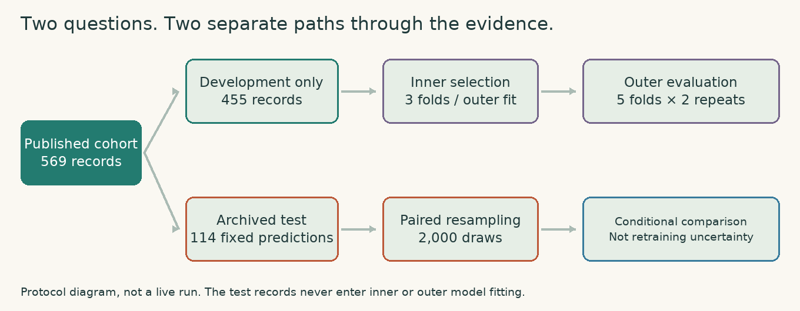
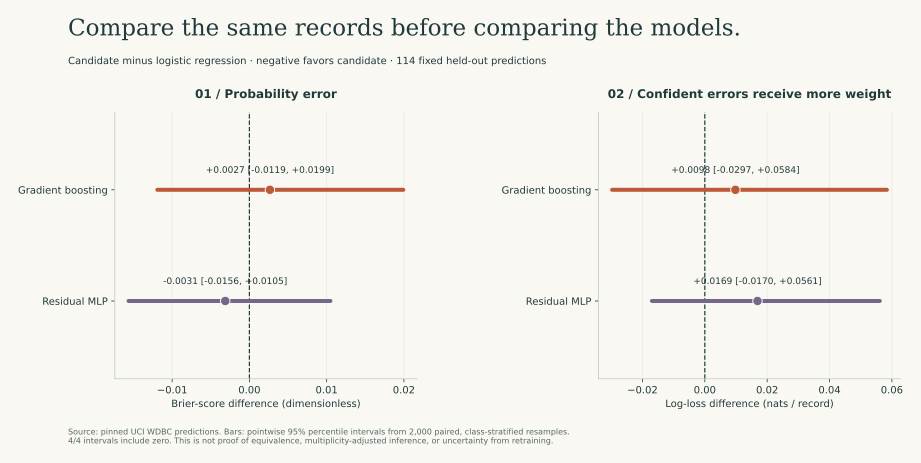
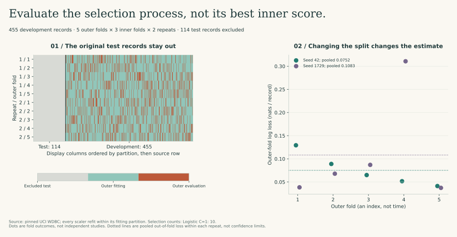
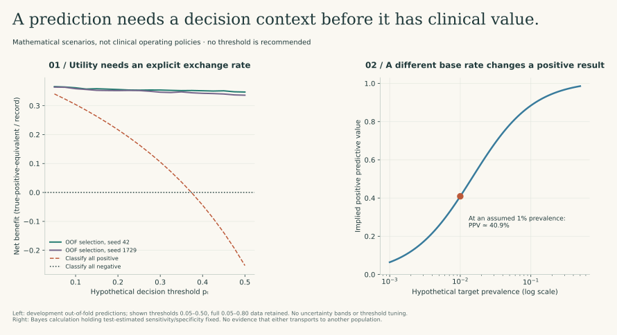

# What would make the comparison convincing?

The first model comparison leaves me with two different questions. Did one **fixed fitted model** make better predictions on the same records? And would the **procedure I use to choose a model** continue to work if I changed the development split? A single confidence interval cannot answer both.

I separate those questions here, then ask a third: even if the statistical comparison is sound, what decision could these measurements legitimately support? That last step changes the interpretation of the entire study.

<picture class="protocol-motion">
<source media="(prefers-reduced-motion: reduce)" srcset="../assets/figures/statistical_flow.png">

</picture>

The diagram is a finite protocol animation, not a live training display. The site provides play/pause controls and uses the static version when reduced motion is requested.

## 1. State the clinical timing before choosing the metric

The Wisconsin features were extracted from digitized images of a **fine-needle aspirate that had already been obtained**. They cannot support a claim about deciding whether to perform that aspiration beforehand. That would require predictors available before the procedure and an appropriately defined target population.

I therefore keep the scientific task narrow: classify published post-FNA feature records and audit the statistical machinery around that classification. A later pathology-review or confirmatory-testing application would need its own observation contract, action definition, cohort, and validation. I do not infer such a workflow from a high benchmark AUC.

This gives me a useful order of work:

| Stage | Question I must answer | Evidence produced here |
| --- | --- | --- |
| Intended use | What decision occurs, for whom, and when? | A bounded post-FNA benchmark; no deployment action is validated |
| Observation | Which measurements are available at that time? | Cited source, feature definitions, versioned snapshots and hashes |
| Estimand | Am I comparing fitted models or a selection procedure? | Separate paired-comparison and nested-selection analyses |
| Implementation | Does preprocessing respect every fitting boundary? | Pipelines, recorded inner/outer row assignments, isolation tests |
| Interpretation | Which uncertainty is included, and which is missing? | Conditional bootstrap intervals, repeat-specific OOF metrics, explicit limits |
| Next decision | What additional study could support clinical or business use? | A proposed external/prospective evaluation, not claimed completed evidence |

## 2. Compare paired losses, not the overlap of separate intervals

For record i, let yᵢ be its binary label and pᵢ its predicted probability. I use two proper scoring rules:

```text
Brier loss:    lᵢ = (pᵢ − yᵢ)²
Log loss:      lᵢ = −yᵢ log(pᵢ) − (1−yᵢ) log(1−pᵢ)
Paired change: dᵢ = lᵢ(candidate) − lᵢ(reference)
Mean change:   Δ = mean(dᵢ)
```

Negative Δ favors the candidate. Logarithms are natural, so log loss is measured in nats per record. For numerical evaluation only, the implementation clips probabilities to floating-point bounds before taking logs; it tests agreement with scikit-learn's scoring functions.

The pairing is essential. A difficult record can be difficult for both models. Sampling each model's predictions independently would discard their covariance and answer a different question. I resample the **same row indices** for both models, separately within the two observed classes, and calculate the loss difference in every resample.



In the recorded 2,000-resample run:

| Candidate versus logistic regression | Mean Δ Brier | Pointwise 95% interval | Mean Δ log loss | Pointwise 95% interval |
| --- | ---: | --- | ---: | --- |
| Gradient boosting | +0.00266 | [−0.01192, +0.01993] | +0.00981 | [−0.02973, +0.05839] |
| Residual MLP | −0.00313 | [−0.01564, +0.01049] | +0.01690 | [−0.01695, +0.05612] |

All four intervals include zero. I cannot turn that into evidence that the models are equivalent: an equivalence study needs a defensible margin and a suitable design. Nor do I call the smaller MLP Brier score a reliable improvement merely because its point estimate is favorable.

### Be precise about the conditioning

Class-stratified resampling fixes the observed class counts. If π̂ is the test-set malignant fraction, the resampled contrast targets a mixture of conditional mean differences with those fixed weights:

```text
Δ = π̂ E[d | y=1] + (1−π̂) E[d | y=0]
```

The fitted models, their training histories, and π̂ are held fixed. These intervals do not include retraining, hyperparameter selection, uncertainty in target prevalence, hospital shift, or dependence between repeated specimens. They are pointwise percentile intervals for a **post-hoc explanatory analysis**, not multiplicity-adjusted confirmatory tests. I do not assign p-values to the bootstrap fraction below zero.

## 3. Evaluate model selection outside the loop that performs it

The original 114 test records remain excluded. I combine the original training and validation partitions into 455 development records, then apply five outer folds and three inner folds under two declared seeds, 42 and 1729.

Within each outer fitting partition:

1. I create the inner folds.
2. I fit each candidate independently inside each inner fitting fold, including its preprocessing.
3. I assemble inner out-of-fold probabilities and compute one record-weighted log loss per candidate.
4. I select the candidate with the lowest inner OOF log loss.
5. I refit that candidate on the full outer fitting partition.
6. I predict the outer evaluation records, which have not influenced that selection.

The grid is deliberately small and explicit: logistic C values 0.1, 1, and 10; histogram-boosting maximum leaf counts 3 and 7, with the other settings fixed. A fixed C=1 logistic model is fitted on the same outer partitions as a reference. The neural model is **not** part of this nested grid; the paired neural comparison above concerns the archived fitted model only.



C=1 logistic regression was selected in all ten outer fits. The adaptive procedure consequently produces the same predictions as the fixed logistic reference in this declared grid. Its pooled OOF log loss is **0.07523** for seed 42 and **0.10827** for seed 1729.

That difference between partitionings is more informative than pretending another decimal place on the original test AUC settles the matter. It also does not give me two independent studies. The repeats reuse the same records, and the folds share fitting data. I do not perform a naïve t-test across the ten folds or label their spread a confidence interval.

Nested evaluation estimates the behavior of a declared **selection procedure**, not the performance of a final model fitted to all development records. It reduces selection-related optimism under its assumptions; it does not remove dataset bias, analyst adaptation across repeated experiments, or the need for external evaluation.

## 4. A decision curve needs a defensible exchange rate

I first write down a simple loss model. If a false positive costs C_FP and a false negative costs C_FN, while correct decisions have zero cost, the expected losses at risk p are `C_FP(1−p)` for a positive decision and `C_FN p` for a negative decision. Comparing them gives the cutoff `p* = C_FP / (C_FP + C_FN)`.

That derivation assumes calibrated risk for the intended population and the stated cost structure. It does not account automatically for capacity constraints, heterogeneous preferences, intervention harms among true positives, or downstream consequences. I cannot estimate those costs from this benchmark's labels alone.

A threshold pₜ therefore encodes an exchange rate rather than a universally correct number. One common net-benefit calculation is:

```text
NB(pₜ) = TP(pₜ)/n − FP(pₜ)/n × pₜ/(1−pₜ)
```

The units are true-positive-equivalent benefit per record, relative to classifying everyone negative. The all-positive reference is `π̂ − (1−π̂) pₜ/(1−pₜ)`; the all-negative reference is zero. Tests compare the implementation with hand calculations and both default strategies.

I calculate the curves from development OOF predictions rather than resubstitution predictions. The figure shows thresholds 0.05–0.50 for readability; the report retains 0.05–0.80. This is a mathematical illustration, not a recommendation for that threshold range, and I do not pick the visually best threshold.



A favorable curve does not establish clinical usefulness when the action, population, outcome timing, and benefit/harm trade-off have not been validated. The dataset's features are already post-FNA; interpreting these curves as proof of pre-FNA screening benefit would be a temporal misuse of the measurements. There are no uncertainty bands here, and calibration or prevalence shift could materially change the decision analysis.

## 5. Test the base-rate assumption instead of hiding it

Even if sensitivity Se and specificity Sp stayed unchanged, positive predictive value would depend on prevalence π:

```text
PPV = Se × π / [Se × π + (1−Sp) × (1−π)]
```

The illustration holds the original test estimates, Se = 40/42 and Sp = 71/72, fixed. At an **assumed** prevalence of 1%, the implied PPV is approximately 40.9%. This is not a measured result in a 1%-prevalence population; it is a conditional Bayes calculation. Sensitivity and specificity may also change under a new case mix or measurement process, so the calculation is not a transportability correction.

For a real R&D or healthcare decision, I would obtain the relevant prevalence and workflow costs rather than import them from a diagnostic benchmark. I would also evaluate whether the model changes confirmatory-test yield, review workload, missed-case burden, and turnaround time under a prospective protocol. Those outcomes are closer to operational value than a retrospective accuracy claim.

## Reproduce and audit the complete path

```bash
MPLBACKEND=Agg OMP_NUM_THREADS=1 python -m studies.statistical_validation
MPLBACKEND=Agg python -m studies.statistical_figures
python -m pytest tests/test_statistical_validation.py -v
python scripts/build_site.py
```

- [Analysis implementation](statistical_validation.py): aligned predictions, paired resampling, nested fitting, decision-curve and predictive-value arithmetic.
- [Recorded statistical report](results/statistical_validation.json): data/output hashes, inner and outer row assignments, candidate scores, selections, repeat metrics, and uncertainty scope.
- [Nested OOF predictions](results/nested_predictions.csv): one prediction per development record per repeat, with source-row identity preserved.
- [Figure implementation](statistical_figures.py): every quantitative panel derives from the report; the animation depicts the protocol rather than simulated computation.

The tests check scoring rules against reference implementations, exact zero differences for identical predictions, reversal symmetry of paired contrasts, isolation of every inner/outer partition, one OOF prediction per record per repeat, and decision calculations against explicit examples.

## What I would do next

I would first define an actual clinical or research action and obtain the metadata needed to test it: site, date, specimen/person identity, feature availability, relevant outcomes, and intended population. I would then lock a protocol for external or temporal evaluation, assess calibration and meaningful subgroups, and quantify uncertainty at the correct biological unit. If the intended claim were equivalence or noninferiority, I would justify its margin and sample size before inspecting the evaluation results.

This work is a reproducible statistical audit of a public benchmark. It does not substitute for external validation, an assay-specific clinical protocol, or evidence that a decision improves outcomes.

## Methodological sources

- Efron (1979), *Bootstrap Methods: Another Look at the Jackknife*, The Annals of Statistics 7(1):1–26, DOI 10.1214/aos/1176344552. [Primary paper](https://sites.stat.washington.edu/courses/stat527/s13/readings/ann_stat1979.pdf). This supplies the general resampling foundation; the paired, class-stratified procedure and its conditioning are specified explicitly above.
- Varma and Simon (2006), *Bias in error estimation when using cross-validation for model selection*, BMC Bioinformatics 7:91, DOI 10.1186/1471-2105-7-91. [Primary paper](https://bmcbioinformatics.biomedcentral.com/counter/pdf/10.1186/1471-2105-7-91.pdf).
- Vickers and Elkin (2006), *Decision Curve Analysis: A Novel Method for Evaluating Prediction Models*, Medical Decision Making, DOI 10.1177/0272989X06295361. [Primary paper](https://journals.sagepub.com/doi/10.1177/0272989X06295361); [interpretation guidance](https://pmc.ncbi.nlm.nih.gov/articles/PMC6777022/).
- Collins et al. (2024), *TRIPOD+AI statement*, BMJ 385:e078378, DOI 10.1136/bmj-2023-078378. [Reporting guidance](https://pmc.ncbi.nlm.nih.gov/articles/PMC11019967/). I use it to identify reporting gaps; a checklist is not a validation certificate.
- Original measurements and reuse terms: [UCI WDBC provenance](../data/README.md), DOI 10.24432/C5DW2B, CC BY 4.0.
